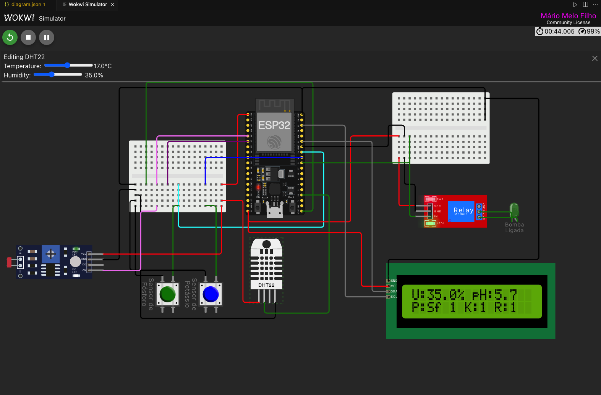
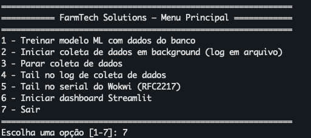

# ESP32 Tech Farm Solutions MEM

Este projeto implementa um sistema de controle agrícola utilizando um ESP32, dois botões, dois sensores analógicos e um relé para acionar uma saída (por exemplo, uma bomba de irrigação).

Use [Wokwi for Visual Studio Code](https://marketplace.visualstudio.com/items?itemName=wokwi.wokwi-vscode) to simulate this project.

## Funcionamento do Programa

O programa realiza a leitura dos seguintes dispositivos conectados ao ESP32:

- **Botão Sensor de Fósforo** (GPIO 19)
- **Botão Sensor de Potássio** (GPIO 18)
- **Sensor Analógico 1** (GPIO 34)
- **Sensor Analógico 2** (GPIO 15)
- **Relé** (GPIO 5), que representa a saída do sistema

### Lógica de Controle

A cada ciclo do loop principal, o programa:

1. **Lê o estado dos botões**: Considera pressionado quando o valor lido é LOW (devido ao uso de `INPUT_PULLUP`).
2. **Lê os valores dos sensores analógicos**: Utiliza `analogRead()` para obter os valores dos sensores conectados aos pinos 32 e 33.
3. **Decide se o relé deve ser acionado**:
   - O relé será ligado se **qualquer um dos botões for pressionado** ou se **o valor do Sensor Analógico 1 for menor que 2000**.
   - Caso contrário, o relé permanece desligado.
4. **Envia informações para o monitor serial**: Mostra o estado dos botões, valores dos sensores e o estado do relé para fins de depuração.

### Exemplo de Saída no Serial Monitor

```
Fósforo: 0 | Potássio: 1 | Sensor1: 1800 | Sensor2: 2500 | Relé: LIGADO
```

### Diagrama Simplificado

```
[Botão Fósforo] --- GPIO 19
[Botão Potássio] --- GPIO 18
[Sensor Analógico 1] --- GPIO 34
[Sensor Analógico 2] --- GPIO 15
[Relé (Saída)] --- GPIO 5
[LCD (Saída)] --- GPIO 21/22
```
### Circuito Simulador



## Como usar

1. Abra o terminal na pasta do projeto e execute `make` para ativar o python virtual environment
1. Execute `pio run` para executar o "build" do simulador
2. Abra o projeto no Visual Studio Code, pressione **F1** e selecione "Wokwi: Start Simulator"..
3. Abra o monitor serial para acompanhar o funcionamento.
4. Pressione os botões ou altere os valores dos sensores para observar o acionamento do relé.

### Iniciando Coleta de dados e apresentação

1. Na raiz do projeto execute: `./farmtech_main.py`

Um menu será apresentado:



1. Treine o modelo com dados novos. O banco de dados já vem com 10 dias de dados treinados
2. Inicia a coleta de dados em background. Lista o arquivo onde a saída do comando é gerada
3. Para a coleta de dados, caso esteja em execução
4. Mostra as ultimas linhas do arquivo com a saída da coleta de dados em tempo real
5. Mostra os ultimos dados diretamente do serial do Sensor, caso esteja gerando dados
6. Inicia o Dashboard com dados de previsão do modelo em tempo real
7. Sair do applicativo 

#### Detalhes Coleta de dados
[Informacoes Adicionais e detalhes](backend/README.md)
