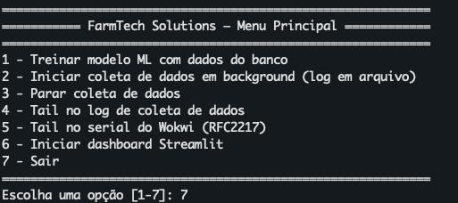

## Pré-requisitos

* Python 3.x instalado
* [pyserial](https://pypi.org/project/pyserial/)
* [dash](https://pypi.org/project/dash/)
* [pandas](https://pypi.org/project/pandas/)
* [plotly](https://pypi.org/project/plotly/)
* ESP32 com firmware do projeto, enviando dados via serial
* Wokwi (VSCode ou CLI) configurado para expor RFC2217 na porta 8180
  (ou use `/dev/ttyUSB0`, `COM3` etc. para hardware real)

Para instalar todas as dependências:

```bash
pip install platformio pyserial pandas dash plotly scikit-learn streamlit watchdog tqdm
```

ou basta rodar make se tiver disponivel

```bash
make
```

O mesmo irá ler o arquivo requirements.txt, instalar as dependencias e iniciar um shell com elas ativas

---
## Como Executar Coleta e Dashboard

Para iniciar o sistema integrado (coletor de dados + dashboard), **rode o script principal** `farmtech_main.py` no diretório raiz do projeto:

```bash
python farmtech_main.py
```

* O script Apresnta um menu:




1. executa: `./backend/train_model.py`
2. executa: `./backend/farmtech_coleta_dados.py`
6. executa: `./backend/farmtech_streamlist.py`

Estes scripts podem ser executados individualmente

Extras:

1. `./backend/simula_dados.py`: cria dados simulados diretamente na base de dados
2. Para zerar a base, remova o arquivo form_data.db e execute `./backend/farmtech_coleta_dados.py`
3. Apos zerar a base de coletar ou gerar novos dados simulados, execute  `./backend/train_model.py` para retreinar o modelo


---
## Resumo

O armazenamento de dados enviados por um ESP32 (via simulação Wokwi ou hardware real) a um banco de dados relacional (SQLite), utilizando um modelo de entidade-relacionamento (MER) robusto e pronto para automação agrícola.
Dados coletados no banco de dados são treinados no arquivo

### Principais Entidades e Relacionamentos

* **Cultura**: Cadastro de culturas agrícolas e nutrientes principais.
* **TalhaoCacau**: Representa áreas monitoradas, associadas a uma cultura.
* **DispositivoCampo**: Cadastro dos dispositivos e sensores.
* **MedidaSolo**: Registra cada amostra dos sensores:

  * Umidade (DHT22)
  * pH (simulado via LDR)
  * NPK (botões simulando fósforo e potássio)
  * Sensores analógicos extras
  * Temperatura, previsão de chuva, crescimento percentual (opcional)
  * Relacionamento com DispositivoCampo e TalhaoCacau
* **AcaoAgricola**: Recomendações baseadas em medidas do solo.
* **HistoricoAcao**: Histórico de execução das recomendações.


---

## Operações Realizadas

* Criação automática do banco e tabelas conforme o MER.
* Inserção de novos dados dos sensores em `MedidaSolo` com todos os relacionamentos.
* População automática dos registros básicos de Cultura, DispositivoCampo e TalhaoCacau, se necessário.
* Coleta contínua dos dados do ESP32 via serial (RFC2217/TCP ou hardware real).
* Dashboard web em tempo real para visualização das medições.
* Pronto para consulta, exportação e integração com outras ferramentas.

---


## Exemplo de Registro em `MedidaSolo`

| id\_medida | data\_hora          | valor\_umidade | valor\_ph | valor\_npk           | id\_dispositivo | id\_talhao |
| ---------- | ------------------- | -------------- | --------- | -------------------- | --------------- | ---------- |
| 1          | 2024-05-20 19:10:32 | 37.2           | 6.32      | Fósforo:1,Potássio:0 | 1               | 1          |
| 2          | 2024-05-20 19:13:07 | 35.0           | 5.8       | Fósforo:0,Potássio:1 | 1               | 1          |

---

## Referências

* [PySQLite documentation](https://docs.python.org/3/library/sqlite3.html)
* [pyserial documentation](https://pyserial.readthedocs.io/en/latest/)
* [Dash documentation](https://dash.plotly.com/)
* [Wokwi Docs: Serial RFC2217](https://docs.wokwi.com/vscode/serial-tcp#rfc2217-support)
* [Modelo relacional para IoT](https://www.sciencedirect.com/science/article/pii/S1877050920311680)

---

**Author:** Mário (DevOps/SRE)
**Version:** 1.20
**Date:** 2025-05-20
